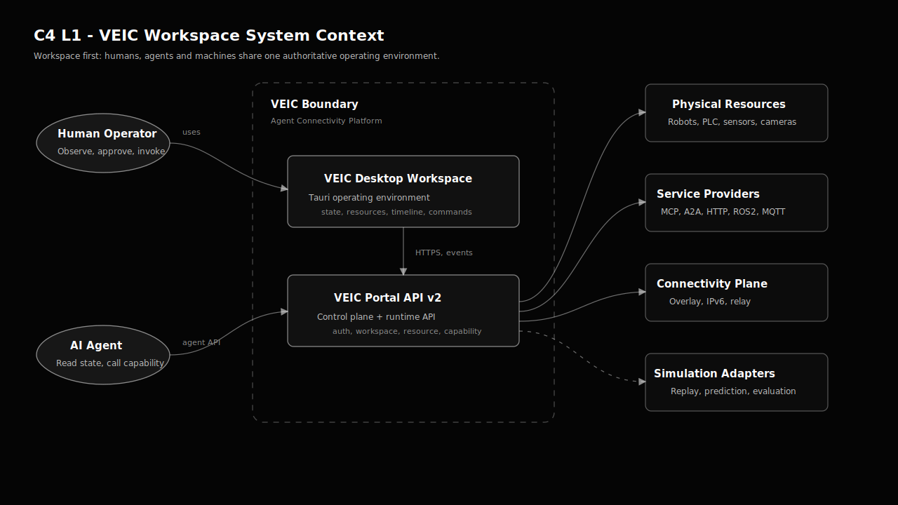
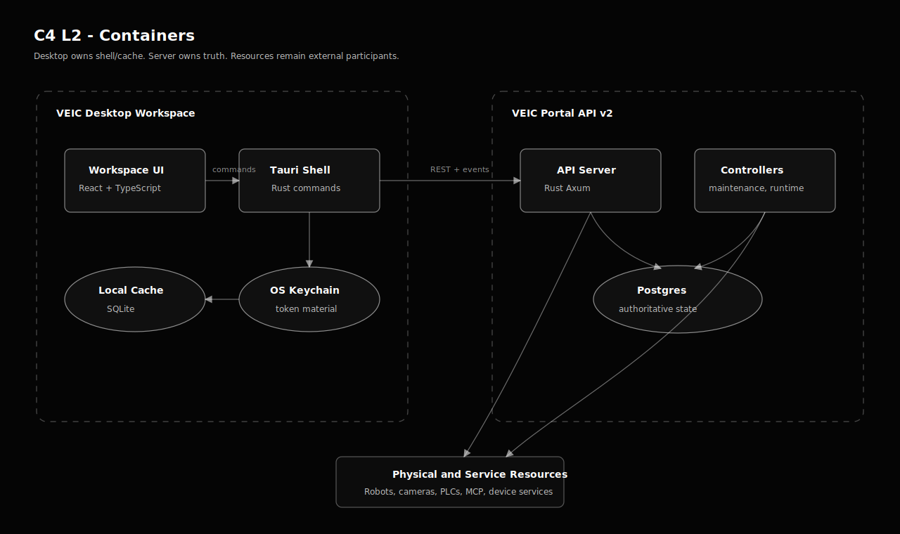
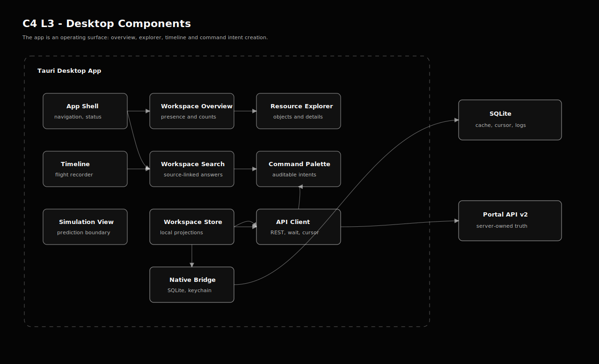
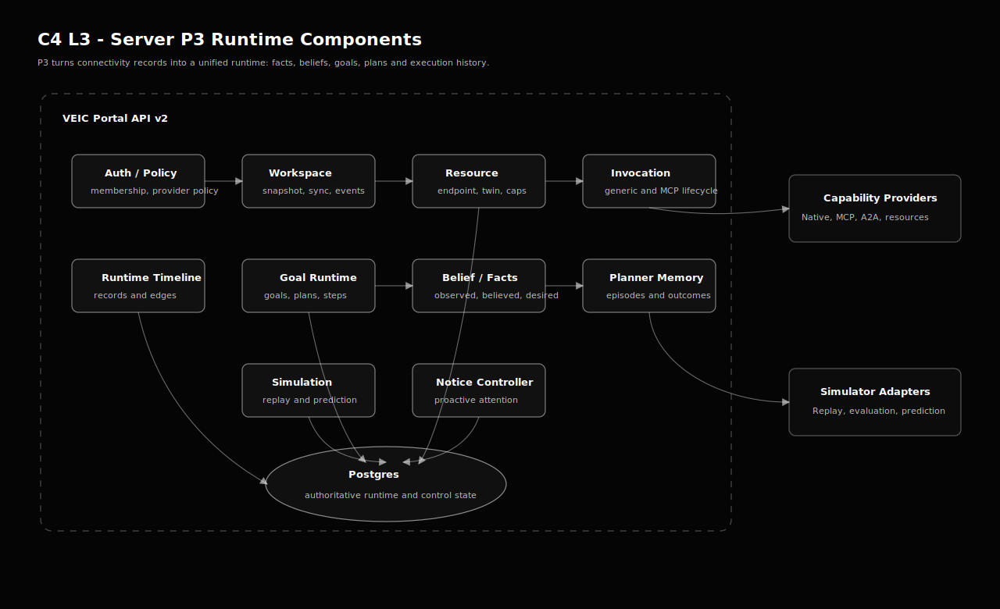
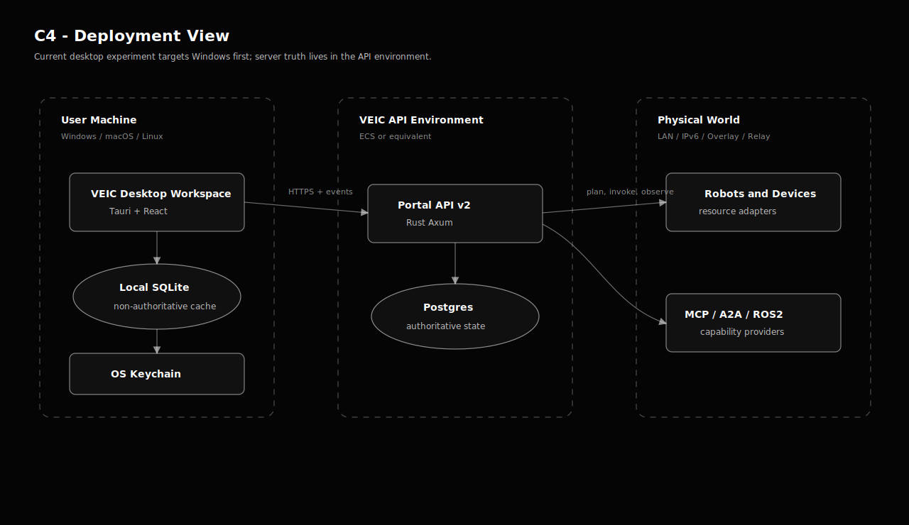

# C4 Architecture

This C4 model is for the VEIC Tauri desktop Workspace app. It assumes the API remains in `E:\workspace\veic-ui\veic-desktop\server` and the visual language follows `E:\workspace\veic-ui\veic-desktop\veicApiWeb`.

The rendered diagrams are maintained as SVG files under `docs/c4/svg`. Do not export or commit PNG diagrams for this document; SVG stays readable in Git, scales cleanly, and can be embedded directly by documentation sites.

## Level 1 - System Context

## Level 2 - Container

## Level 3 - Desktop Components

## Level 3 - Server P3 Components

## Deployment View

## Architecture Decisions

- The app opens into Workspace state, not chat.
- Server owns truth. Tauri owns local cache and native shell behavior.
- Workspace event long-poll plus `/sync?afterRevision=` currently drives live updates; SSE remains a later option when auth handling is settled.
- Timeline queries should read runtime records first, then hydrate details from existing invocation, resource and twin APIs.
- Command Palette should create auditable intents before high-risk real-world invocation.
- Simulation is a first-class safety boundary, not a visual afterthought.
- The visual system should stay close to `veicApiWeb`: black base, JetBrains Mono, monochrome data surfaces, 8px panels, restrained motion and Bayer texture where useful.

## Diagram Source Policy

- Primary rendered files: `docs/c4/svg/*.svg`.
- PNG exports are intentionally avoided.
- If a Mermaid or PlantUML source is added later, it must be treated as source only; the document should still embed SVG as the primary view.
